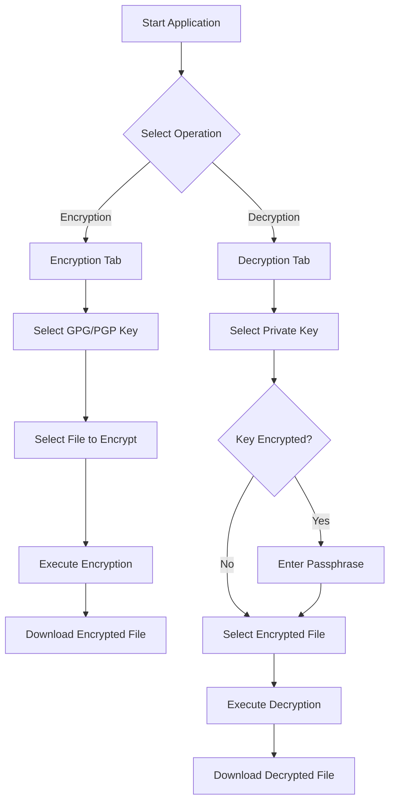
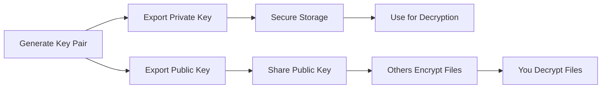
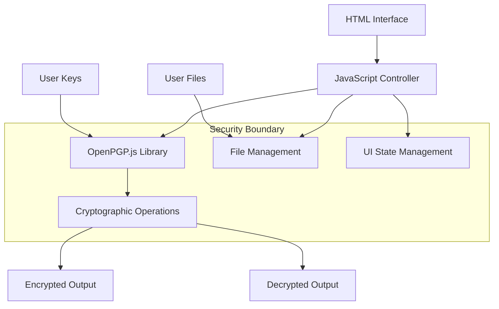

# xsukax GPG/PGP File Encryptor/Decryptor

[](https://www.gnu.org/licenses/gpl-3.0)
[](https://openpgpjs.org/)
[](https://github.com/xsukax/xsukax-GPG-PGP-File-Encryptor-Decryptor)

A secure, client-side web application for encrypting and decrypting files using GPG/PGP cryptography. Built with modern web technologies and designed with privacy and security as core principles.

## Project Overview

The xsukax GPG/PGP File Encryptor/Decryptor is a browser-based cryptographic tool that enables users to securely encrypt and decrypt files using established GPG/PGP standards. The application operates entirely within the user's browser, ensuring that sensitive data never leaves the local environment.

This tool addresses the growing need for accessible, user-friendly file encryption solutions that maintain the highest security standards while remaining simple enough for both technical and non-technical users. By leveraging the robust OpenPGP.js library, the application provides enterprise-grade encryption capabilities through an intuitive web interface.

### Core Functionalities

- **File Encryption**: Encrypt any file type using GPG/PGP public or private keys
- **File Decryption**: Decrypt GPG/PGP encrypted files using private keys
- **Key Management**: Support for multiple key formats (.asc, .gpg, .pgp)
- **Passphrase Handling**: Intelligent detection and secure processing of encrypted private keys
- **Cross-Platform Compatibility**: Works on any modern web browser across all operating systems

## Security and Privacy Benefits

### Client-Side Processing
All cryptographic operations are performed locally within the user's browser. No files, keys, or passphrases are ever transmitted to external servers, ensuring complete data sovereignty and eliminating potential attack vectors associated with server-side processing.

### Zero Data Retention
The application maintains no persistent storage of user data. All files, keys, and cryptographic materials are processed in memory and discarded upon completion of operations or browser session termination.

### Secure Key Validation
- **Automatic Passphrase Detection**: The application intelligently determines whether private keys require passphrases without compromising security
- **Key Format Validation**: Comprehensive validation ensures only properly formatted GPG/PGP keys are accepted
- **Secure Memory Handling**: Cryptographic materials are handled using secure memory practices to minimize exposure

### Industry-Standard Cryptography
- **OpenPGP.js Integration**: Utilizes the extensively audited OpenPGP.js library (v5.10.2)
- **RFC 4880 Compliance**: Full compliance with OpenPGP standards ensuring interoperability
- **Modern Algorithms**: Support for contemporary cryptographic algorithms including Curve25519

### Privacy-First Design
- **No Analytics or Tracking**: The application contains no telemetry, analytics, or tracking mechanisms
- **Offline Capability**: Can function completely offline once loaded, eliminating network-based privacy concerns
- **Minimal Attack Surface**: Reduced complexity and dependencies minimize potential security vulnerabilities

## Features and Advantages

### User Experience
- **Intuitive Interface**: Clean, professional terminal-inspired design with clear visual feedback
- **Dual Theme Support**: Dark and light themes for comfortable use in any environment
- **Responsive Design**: Optimized for desktop, tablet, and mobile devices
- **Accessibility**: Full keyboard navigation and screen reader support

### Technical Capabilities
- **Universal File Support**: Encrypt any file type regardless of size or format
- **Flexible Key Handling**: Accepts both public and private keys for encryption operations
- **Smart Error Handling**: Comprehensive error detection with user-friendly messaging
- **Progressive Enhancement**: Graceful degradation ensures functionality across browser versions

### Operational Benefits
- **No Installation Required**: Runs directly in web browsers without software installation
- **Platform Independent**: Compatible with Windows, macOS, Linux, and mobile platforms
- **Network Optional**: Functions offline for enhanced security and privacy
- **Instant Deployment**: Can be hosted on any web server or used as a local file

## Installation Instructions

### Option 1: Direct Browser Usage
1. Download the latest release from the [GitHub repository](https://github.com/xsukax/xsukax-GPG-PGP-File-Encryptor-Decryptor)
2. Extract the files to a local directory
3. Open `index.html` in any modern web browser
4. The application is immediately ready for use

### Option 2: Local Web Server
For enhanced security and functionality, serve the application through a local web server:

#### Using Python (Recommended)
```bash
# Clone the repository
git clone https://github.com/xsukax/xsukax-GPG-PGP-File-Encryptor-Decryptor.git
cd xsukax-GPG-PGP-File-Encryptor-Decryptor

# Start local server (Python 3)
python -m http.server 8000

# Access at http://localhost:8000
```

#### Using Node.js
```bash
# Install a simple HTTP server
npm install -g http-server

# Navigate to project directory and start server
http-server -p 8000

# Access at http://localhost:8000
```

### Option 3: Production Deployment
Deploy to any web hosting service by uploading the files to the web root directory. The application is completely self-contained and requires no server-side processing.

### System Requirements
- **Browser**: Any modern web browser with JavaScript enabled
- **JavaScript**: ES6+ support (Chrome 61+, Firefox 60+, Safari 12+, Edge 79+)
- **Memory**: Minimum 512MB RAM (recommended 1GB+ for large files)
- **Storage**: No persistent storage required

## Usage Guide

### Basic Workflow

The application provides two primary modes of operation through an intuitive tabbed interface:



### Encryption Process

1. **Navigate to Encryption Tab**
   - Click the "Encryption" tab in the application interface

2. **Select Cryptographic Key**
   - Click "Choose File" under "GPG/PGP Key File"
   - Select a public key (.asc, .gpg, or .pgp file) for standard encryption
   - Alternatively, use a private key if available

3. **Select Target File**
   - Click "Choose File" under "File to Encrypt"
   - Select any file you wish to encrypt

4. **Execute Encryption**
   - Click "Execute Encryption" button
   - Wait for processing completion

5. **Download Result**
   - Click "Download Result" to save the encrypted file
   - File will be saved with .asc extension

### Decryption Process

1. **Navigate to Decryption Tab**
   - Click the "Decryption" tab in the application interface

2. **Select Private Key**
   - Click "Choose File" under "Private Key File"
   - Select your private key (.asc, .gpg, or .pgp file)

3. **Handle Passphrase (if required)**
   - If the private key is encrypted, a modal will appear
   - Enter your passphrase securely
   - Leave blank if the key has no passphrase

4. **Select Encrypted File**
   - Click "Choose File" under "Encrypted File"
   - Select the encrypted file to decrypt

5. **Execute Decryption**
   - Click "Execute Decryption" button
   - Wait for processing completion

6. **Download Result**
   - Click "Download Result" to save the original file
   - Original filename and extension will be restored

### Advanced Usage

#### Key Management Best Practices


#### Security Recommendations
- **Key Storage**: Store private keys in secure locations with appropriate access controls
- **Passphrase Security**: Use strong, unique passphrases for private key protection
- **File Verification**: Verify file integrity after encryption/decryption operations
- **Environment Security**: Use the application in trusted environments only

#### Troubleshooting Common Issues

| Issue | Cause | Solution |
|-------|-------|----------|
| "Invalid key file" error | Corrupted or wrong format | Verify key file format and integrity |
| "Incorrect passphrase" error | Wrong passphrase entered | Retry with correct passphrase |
| Browser compatibility issues | Outdated browser | Update to modern browser version |
| Large file processing slow | Memory limitations | Use smaller files or increase browser memory |

### Performance Considerations

- **File Size Limits**: While theoretically unlimited, browser memory constraints may affect very large files (>1GB)
- **Processing Time**: Encryption/decryption time scales with file size and system capabilities
- **Browser Optimization**: Modern browsers with hardware acceleration provide optimal performance

## Technical Architecture

### Application Structure


### Dependencies
- **OpenPGP.js v5.10.2**: Core cryptographic functionality
- **Modern Browser APIs**: File handling and cryptographic operations
- **No External Services**: Complete client-side operation

## Licensing Information

This project is licensed under the **GNU General Public License v3.0** (GPL-3.0).

### License Summary
- **Freedom to Use**: Use the software for any purpose
- **Freedom to Study**: Access and modify the source code
- **Freedom to Share**: Distribute copies of the software
- **Freedom to Improve**: Distribute modified versions

### Key License Terms
- Any derivative works must also be licensed under GPL-3.0
- Source code must be made available when distributing the software
- All modifications must be clearly documented
- No warranty is provided with the software

### Full License Text
The complete license text is available in the [LICENSE](LICENSE) file in this repository or at [https://www.gnu.org/licenses/gpl-3.0.html](https://www.gnu.org/licenses/gpl-3.0.html).

## Contributing

We welcome contributions to improve the xsukax GPG/PGP File Encryptor/Decryptor. Please read our contributing guidelines and ensure all contributions align with the project's security and privacy principles.

### Development Guidelines
- Maintain client-side only architecture
- Preserve zero-data-retention principles
- Ensure cross-browser compatibility
- Follow established coding standards
- Include comprehensive testing

## Security Reporting

If you discover security vulnerabilities, please report them responsibly by creating a private issue or contacting the maintainers directly. Do not disclose security issues publicly until they have been addressed.

---

**Disclaimer**: This software is provided "as-is" without warranty. Users are responsible for proper key management and security practices. Always verify the integrity of encrypted/decrypted files and maintain secure backups of important data.
